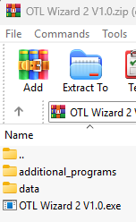

# OTLMOW-GUI
[](https://pypi.org/project/otlmow-gui/)
[](https://pypi.org/project/otlmow-gui/)
[](https://github.com/davidvlaminck/OTLMOW-GUI/actions/workflows/unittest.yml)

[](https://github.com/davidvlaminck/OTLMOW-GUI/issues)
[](https://htmlpreview.github.io/?https://github.com/davidvlaminck/OTLMOW-GUI/blob/master/UnitTests/htmlcov/index.html)


## Summary
The main use case of the otlmow-gui is to provide a graphical user interface for the OTLMOW project. It is built using the [PyQt6 framework](https://www.riverbankcomputing.com/software/pyqt/intro) and is compatible with Python 3.7 and higher. This will eventually replace the OTL wizard.

## OTLMOW Project 
This project aims to implement the Flemish data standard OTL (https://wegenenverkeer.data.vlaanderen.be/) in Python.
It is split into different packages to reduce compatibility issues
- [otlmow_model](https://github.com/davidvlaminck/OTLMOW-Model)
- [otlmow_modelbuilder](https://github.com/davidvlaminck/OTLMOW-ModelBuilder)
- [otlmow_converter](https://github.com/davidvlaminck/OTLMOW-Converter)
- [otlmow_template](https://github.com/davidvlaminck/OTLMOW-Template)
- [otlmow_postenmapping](https://github.com/davidvlaminck/OTLMOW-PostenMapping)
- [otlmow_davie](https://github.com/davidvlaminck/OTLMOW-DAVIE)
- [otlmow_visuals](https://github.com/davidvlaminck/OTLMOW-Visuals)
- [otlmow_gui](https://github.com/davidvlaminck/OTLMOW-GUI) (you are currently looking at this package)

## Installation guide
### NEEDS atleast python 3.13.2 to use the pyinstaller_script.py to create a .exe file
Currently, you need at least Python version 3.9 to use this library.

To install the OTL MOW project into your Python project, use pip to install it:
``` 
pip install otlmow_gui
```
To upgrade an existing installation use:
``` 
pip install otlmow_gui --upgrade
```
To run the OTL-wizard do the following:
```
python OTLWizard.py
```

We are working on a way to deploy this to the different operating systems. This is expected near the end of 2023.

## Translations guide

1. Install babel in a seperate python environment so it doesn't end up in the requirements.txt  
`pip install babel`
2. Generate the locale\base.pot file from the strings in your python code by running using the seperate python environment:  
    `pybabel extract -F babel.cfg -o locale\base.pot .\Domain .\GUI .\Exceptions`
2. Update the `locale\\<language_code>\LC_MESSAGES\message.po` files to the new base.pot using the seperate python environment   with:  
    `pybabel update -i .\locale\base.pot -d locale --no-fuzzy-matching`
3. Find your `new_text_key` in the `locale\\<language_code>\LC_MESSAGES\message.po` of each language and fill in the
tranlation for that text in like:
    ```
    msgid "new_text_key"
    msgstr "The translation for this new key"
    ```
   if you don't know all the text_keys you added you can search for `msgstr ""` to find all msgids that have no translation yet
  

4. Compile new translations into messages.mo files using the seperate python environment  
    `pybabel compile -d locale`
    
## exe and installer creation guide

1. Make sure you have a python 3.13 environment with the requirements.txt installed set up  
    NOTE: Keep using PyInstaller 6.10.0, newer version can get [false positives](https://github.com/pyinstaller/pyinstaller/issues/5854) on Windows Defender. Lookout for detections of 
    Wacatac.B!ml, Wacatac.H!ml, Wacapew.C!ml these are false positives. 
    They get detected only when you compile with newer versions and not when you compile with older versions of PyInstaller.
    If any user has a detection, it is most likely because of an outdated Windows Defender. Ask them to update Windows and/or Windows Defender.  
  

2. To change the version number of OTL Wizard 2, you need to change two version variables.  
   These are:  
    variable `version = "<your_version_number>"` in `pyproject.toml`  
    variable `#define MyAppVersion "<your_version_number>"` in `LatestReleaseMulti/inno_setup_installer_setup_script.iss`  
  

3. Run the `pyinstaller_script.py` in that environment.  
    This will make the file:`LatestReleaseMulti/OTL Wizard 2/OTL Wizard 2.exe`  
    and accompanying folder:`LatestReleaseMulti/OTL Wizard 2/data`
  

4. Sign the `LatestReleaseMulti/OTL Wizard 2/OTL Wizard 2.exe` file with windows [signtool](https://learn.microsoft.com/en-us/windows/win32/seccrypto/signtool) to get this signtool you need to install the [windows SDK](https://developer.microsoft.com/en-us/windows/downloads/windows-sdk/)  
   Get a certificate from the Vlaamse Overheid or Agentschap Wegen en Verkeer.  
   Use this certificate to sign the generated exe-file with the command:  
   `C:\"Program Files (x86)"\"Windows Kits"\10\"App Certification Kit"\signtool.exe sign /f "<absolute path to certificate file>" /fd SHA256 "<absolute path to OTL Wizard 2.exe file>"`
  

5. Download and install [Inno Setup Compiler](https://jrsoftware.org/isinfo.php)
  

6. In the `LatestReleaseMulti/inno_setup_installer_setup_script.iss` script replace the MyAppDevRoot variable with the absolute path to the root of your project
  

7. Open `LatestReleaseMulti/inno_setup_installer_setup_script.iss` with Inno Setup Compiler and compile.  
    This should create `LatestReleaseMulti/OTL wizard 2 installer V<version>.exe`
  

8. Sign the `LatestReleaseMulti/OTL wizard 2 installer V<version>.exe` file with windows [signtool](https://learn.microsoft.com/en-us/windows/win32/seccrypto/signtool) from step 3
   Use the same certificate from the Vlaamse Overheid or Agentschap Wegen en Verkeer as that from step 3.  
   Use this certificate to sign the generated installer exe-file with the command:  
   `C:\"Program Files (x86)"\"Windows Kits"\10\"App Certification Kit"\signtool.exe sign /f "<absolute path to certificate file>" /fd SHA256 "<absolute path to OTL wizard 2 installer V<version>.exe file>"`
  

9. To make the zipped version (no install needed).  
    Place the following files and folders into a folder and zip it preferrably with the foldername: `OTL Wizard 2 V<your version number>`:   
    File:`LatestReleaseMulti/OTL Wizard 2/OTL Wizard 2.exe`  (preferrably rename it to `OTL Wizard 2 V<your version number>.exe`)  
    Folder:`LatestReleaseMulti/OTL Wizard 2/data`  
    Folder:`LatestReleaseMulti/additional_programs`  
    The zip should look like this:  
    
  

10. Until V1.1 publishing to the wider audience is done by placing both the zip and installer-exe file in folder `LatestRelease` 
    and push to or merge into the master branch of this repository (OTLMOW-GUI) (needs permission from repository owner)  
    
## Custom logging implementation usage

This project has a custom logging class called OTLLogger.py, it is build on the standard logging library.  
Instead of using `logging.debug("message")` you should use `OTLLogger.logger.debug("message")`
  
This custom logger can also display the time between 2 `OTLLogger.logger.debug()` calls by adding the same `timing_ref` 
to the extra argument in both log calls. Example:  
```
OTLLogger.logger.debug(f"Execute OtlmowConverter.from_file_to_objects({file_path.name})", 
                            extra={"timing_ref": f"file_to_objects_{file_path.stem}"})

object_lists = list(OtlmowConverter.from_file_to_objects(file_path,**kwargs))

OTLLogger.logger.debug(f"Execute OtlmowConverter.from_file_to_objects({file_path.name}) ({len(object_lists)} objects)", 
                            extra={"timing_ref": f"file_to_objects_{file_path.stem}"})
```

## The sleeping cat GIF link
https://giphy.com/gifs/xUA7aZtd2GIfzYDR5e